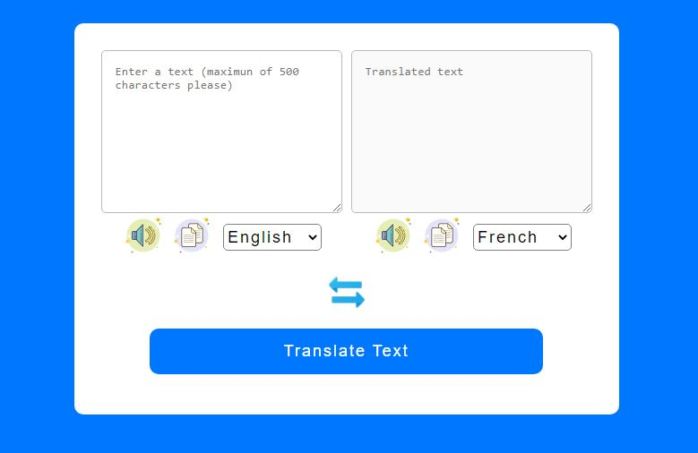

# Language translator 

A simple language translator with text-to-voice and copy functionality. It is built with Javascript, HTML AND CSS 

# Technology used

- Built with HTML, CSS and JavaScript
- This project is built with HTML, CSS and JavaScript
- Memory API  was used to build the tranlation functionality
- The web speech API in JavaScript was used to tranplate the text to speech
- Tha Asynchronous clipboard API was used to build the copy funtionality

## Screenshots

## [Click me for Live Preview](https://giftednathan.github.io/translator)

## Authors

- [@giftednathan](https://www.github.com/giftednathan)

# Hi, I'm Nathaniel! 👋

## 🚀 About Me
I'm a frontend developer, a graphics designer and a content writer

## 🛠 Skills
React, Javascript, HTML, CSS...

## 🔗 Links

## Support

For support, email eje.nathaniel@gmail.com

## Thank you